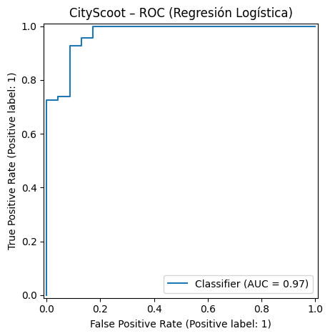
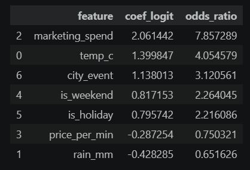
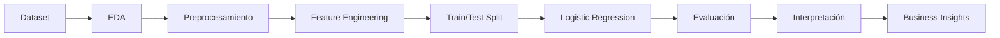

  

# 🛴 CityScoot – Demand classification with logistic regression / CityScoot - Clasificación de la demanda  mediante regresión logística

> **Pipeline de Machine Learning para clasificar la demanda diaria de scooters y demostrar cómo la correcta elección del modelo de análisis depende del objetivo de negocio**.

---

📅 <strong>Dataset:</strong> Demanda diaria de scooters &nbsp;&nbsp;|&nbsp;&nbsp;
🎯 <strong>Problema:</strong> Clasificación binaria &nbsp;&nbsp;|&nbsp;&nbsp;
📈 <strong>Modelo:</strong> Logistic Regression &nbsp;&nbsp;|&nbsp;&nbsp;
🛴 <strong>Caso de uso:</strong> Micromovilidad urbana

---

# 🛠️ Tecnologías utilizadas

---

# 📌 Descripción del proyecto

CityScoot es una empresa de micromovilidad urbana que busca *anticipar la demanda diaria de scooters para optimizar la asignación de flota, la estrategia de precios y la planificación operativa.*

Inicialmente el problema fue planteado como una tarea de **regresión**, cuyo objetivo era estimar el número exacto de viajes diarios. Sin embargo, al redefinir el *objetivo de negocio*, el enfoque evolucionó hacia un problema de **clasificación binaria**, donde el interés pasó a ser *identificar si un día presentará **alta** o **baja demanda***.

Este proyecto demuestra cómo la selección del modelo debe responder al problema de negocio y no únicamente a la naturaleza de los datos.

---

# 🎯 Objetivo del proyecto

Clasificar cada día como 🔴 alta demanda (con más de 1200 viajes) o 🔵 baja demanda (con igual o menos de 1200 viajes) para anticipar decisiones relacionadas con la distribución de scooters y la planificación comercial.

---

# 📂 Estructura del repositorio

| Archivo | Descripción |
|----------|-------------|
| CityScoot_LogisticRegression.ipynb | Pipeline completo de limpieza, modelado y evaluación mediante Regresión Logística |
| Dataset | Datos utilizados para el entrenamiento y evaluación |
| Images | Banner y visualizaciones |
| README.md | Documentación del proyecto |

---

# 📊 Dataset del proyecto

Variables predictoras:

- Temperatura
- Precipitaciones
- Inversión en marketing
- Precio por minuto
- Fin de semana
- Feriado
- Eventos urbanos

Variable objetivo: **high_demand**

---

# ⚙️ Pipeline del proyecto

- Análisis exploratorio (EDA)
- Limpieza y preparación de datos
- Ingeniería de variables
- División en Train/Test
- Escalado (StandardScaler)
- Entrenamiento del modelo
- Evaluación
- Interpretación del modelo

---

# 🤖 Modelo implementado: **Regresión logística**

La **regresión logística** fue seleccionada por su **capacidad para modelar probabilidades en problemas de clasificación binaria y permitir una interpretación directa mediante Odds Ratio**.

---

# 📈 Las *métricas* evaluadas en este proyecto son:

1. Accuracy
2. Precision
3. Recall
4. ROC-AUC
5. Log-Loss
6. Matriz de confusión

---

# 💡 Resultados obtenidos

El modelo obtuvo una adecuada capacidad discriminatoria para diferenciar días de 🔴 alta y 🔵 baja demanda. Además de la predicción, permitió interpretar el efecto de variables como inversión en marketing, lluvia, eventos urbanos y fin de semana sobre la probabilidad de registrar jornadas de *alta demanda*.

---

# 📊 Visualizaciones implementadas

## Curva ROC

  

La curva ROC resume la capacidad discriminatoria del modelo para diferenciar días de alta y baja demanda.

---

## Matriz de confusión

 [19  4]
 
 [ 2 67]

Permite evaluar el equilibrio entre falsos positivos y falsos negativos según el objetivo de negocio.

---

## Importancia de variables

  

Los Odds Ratios permiten interpretar el efecto de cada variable sobre la probabilidad de registrar alta demanda.

---

# 💼 Impacto del modelo elegido sobre el negocio

El modelo de regresión logística permite *anticipar picos de demanda*, *optimizar la clasificación de scooters*, *planificar estratégicamente las campañas de marketing*, *ajustar precios* y *mejorar la planificación operativa*.

---

# 📌 Competencias demostradas en el desarrollo de este proyecto

Implementacion de:
- Machine Learning,
- Clasificación binaria,
- Regresión logística,
- Interpretación de Odds Ratio,
- Ingeniería de características,
- Evaluación de modelos,
- Anañlítica de negocios,
- Storytelling con datos.

---

# 🔄 Flujo de trabajo en el proyecto

---

# ⭐ Aprendizajes

Más allá del desempeño predictivo, el principal aporte del proyecto fue demostrar que **la selección del modelo debe responder al objetivo de negocio**.

El trabajo evidencia la implementación de la estadística en el análisis de los datos y la aplicación de criterio para la interpretación de los mismos y la toma de decisiones.

---

# 👩‍💻 Autora:

**Vanina Cavallin**

Data Scientist | Data Analyst

📧 **E-mail:** vaninacavallin@gmail.com

💼 **LinkedIn:** https://linkedin.com/in/vanina-cavallin

---

⭐ Si este proyecto te resultó interesante, no olvides dejar una estrella al repositorio.
